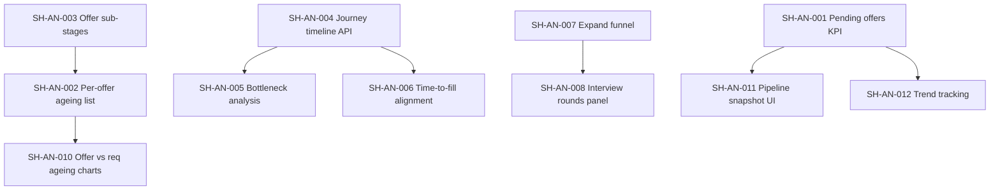

# Smart Hiring Analytics — Issue Register

**Scope:** Offer ageing, pending offers, offer sub-stages, conversion bottleneck analysis, and interview-round timing.

**Last reviewed:** 2026-05-24

**Related docs:** [HIRING_DASHBOARD_KPIS.md](./HIRING_DASHBOARD_KPIS.md) · [SMART_HIRING_DASHBOARD.md](../guides/SMART_HIRING_DASHBOARD.md)

---

## Executive summary

| Req # | Capability | Status | Coverage |
|-------|------------|--------|----------|
| 1 | Timeline — offer-wise ageing | Implemented | ~90% |
| 2 | How many pending offers | Implemented | ~95% |
| 3 | Stages of pending offer | Implemented | ~95% |
| 4 | Conversion time / bottleneck (“why 40 days?”) | Implemented | ~90% |
| 5 | Interview rounds — time per stage | Implemented | ~90% |

**Open issues:** 0 — register closed (2026-05-24)

**Remaining polish:** None — product complete; trends API exposes `last_live_snapshot_at` for ops visibility.

---

## What is implemented (baseline)

| Area | Implementation | Where |
|------|----------------|-------|
| Stage ageing (all active stages incl. OFFER) | Heatmap with buckets `0-7d`, `8-14d`, `15-30d`, `31+d` + avg days | Dashboard → **Time in stage (heatmap)** · `_stage_aging()` |
| Offer SLA / stuck alerts | Alert when candidates in OFFER exceed SLA (default 7d) | Dashboard alerts · `hiring_threshold_config.py` |
| Pending offer count (indirect) | OFFER count in funnel bar; tab badge on Pipeline | Dashboard funnel · Pipeline → **Salary Discussion** |
| Pending offer list (operational) | Applications in `OFFER` stage | Pipeline → Salary Discussion tab |
| Time to fill (aggregate) | Median job `created_at` → application `JOINED` | Dashboard mini KPI · `compute_time_to_fill_days()` |
| Interview round stages (operational) | `INTERVIEW_1`, `INTERVIEW_2`, `INTERVIEW_3`, `HR_ROUND` | Pipeline → Interview tab |
| Interview round ageing (when populated) | Per-stage rows in heatmap if candidates exist in those stages | Dashboard heatmap |
| Stage history (data layer) | `application_stage_history` written on stage changes | `server.py`, `assessments_service.py` |
| Pipeline by stage (API) | `pipeline_by_stage` in hiring-pack response | `GET /api/dashboard/hiring-pack` |
| Requisition ageing | Job-level open-req buckets (not offer-level) | **Requisition aging** chart |

---

## Issue register — pending work

### Legend

| Field | Meaning |
|-------|---------|
| **Priority** | P0 = blocker for analytics ask · P1 = core gap · P2 = enhancement |
| **Req** | Maps to original requirement 1–5 |
| **Effort** | S / M / L (rough) |

---

### SH-AN-001 · Dedicated “Pending offers” KPI tile

| | |
|---|---|
| **Req** | 2 |
| **Priority** | P0 |
| **Effort** | S |
| **Status** | Done (2026-05-24) |

**Gap:** `pipeline_by_stage.OFFER` is computed in the hiring-pack API but not surfaced as a headline KPI. Recruiters must infer count from the funnel chart or open Pipeline.

**Acceptance criteria**

- [x] Dashboard shows a KPI tile **“Pending offers”** with current count of applications in `OFFER` stage (respects scope filters).
- [x] Tile drills to `/pipeline?stage=SALARY`.
- [x] Delta vs prior window period shown (same pattern as other headline KPIs).
- [x] Documented in `HIRING_DASHBOARD_KPIS.md`.

**Touchpoints:** `hiring_dashboard.py` (headline), `hiring_dashboard_schemas.py`, `DashboardPage.jsx`, `hiringDashboardDrill.js`

---

### SH-AN-002 · Per-offer ageing list (offer-wise timeline)

| | |
|---|---|
| **Req** | 1 |
| **Priority** | P0 |
| **Effort** | M |
| **Status** | Done (2026-05-24) |

**Gap:** Offer ageing exists only as an aggregate heatmap row. No per-candidate/per-offer view showing “Offer pending X days since entered OFFER”.

**Acceptance criteria**

- [x] New panel or table: **Offer ageing** listing each application in `OFFER` with candidate name, job, days in offer, entered-offer date.
- [x] Sortable by days descending; filterable by job/owner/department (inherits dashboard scope).
- [x] Uses `application_stage_history` entry for `to_stage=OFFER` (fallback: `updated_at`).
- [x] Row click opens candidate profile or pipeline context.
- [x] SLA breach visually flagged (> configured OFFER SLA days).

**Touchpoints:** New API slice in `hiring_dashboard.py` or `GET /api/dashboard/offer-aging`, new React component on Dashboard or Pipeline

---

### SH-AN-003 · Offer sub-stages / offer lifecycle states

| | |
|---|---|
| **Req** | 3 |
| **Priority** | P0 |
| **Effort** | L |
| **Status** | Done (2026-05-24) — migration `0020_offer_status_backfill.py` |

**Gap:** `OFFER` is a single application stage. `OFFER_ACCEPTED` exists in server enum but is unused in analytics and workflow. No breakdown of pending offer stages (sent, negotiation, accepted pending join, declined).

**Acceptance criteria**

- [x] Define offer lifecycle model (e.g. `OFFER_DRAFT`, `OFFER_SENT`, `OFFER_NEGOTIATION`, `OFFER_ACCEPTED`, `OFFER_DECLINED`) — either as sub-stages or `offer_status` field on application/offer record.
- [x] Recruiters can update offer status from Pipeline Salary tab.
- [x] Dashboard shows **count by offer sub-stage** (stacked bar or KPI strip).
- [x] Stage history logs offer status transitions.
- [x] Migration/seed updates for existing `OFFER` records.

**Touchpoints:** `server.py` (stage enum, PATCH application), `PipelinePage.jsx`, schema/migration, `hiring_dashboard.py`

---

### SH-AN-004 · Per-hire journey timeline (stage decomposition)

| | |
|---|---|
| **Req** | 4 |
| **Priority** | P1 |
| **Effort** | L |
| **Status** | Done (2026-05-24) |

**Gap:** `application_stage_history` is persisted but not exposed in UI. Cannot answer “this hire took 40 days — how long in each stage?”.

**Acceptance criteria**

- [x] API: `GET /api/applications/{id}/stage-history` returns ordered transitions with `from_stage`, `to_stage`, `changed_at`, computed `days_in_stage`.
- [x] Candidate profile (or application detail) shows **Hiring timeline** visual (vertical stepper or Gantt-style).
- [x] Works for in-progress and completed (`JOINED`) applications.

**Touchpoints:** `server.py`, `CandidateProfilePage.jsx` or new `ApplicationTimeline` component

---

### SH-AN-005 · Bottleneck analysis for time-to-conversion

| | |
|---|---|
| **Req** | 4 |
| **Priority** | P1 |
| **Effort** | L |
| **Status** | Done (2026-05-24) |

**Gap:** Time-to-fill is a single median (job open → joined). No decomposition explaining bottlenecks at cohort or role level.

**Acceptance criteria**

- [x] Dashboard widget: **Conversion bottleneck** — for hires in window, show median/mean days contributed by each stage (waterfall or stacked bar).
- [x] Highlight stage with largest median dwell time as “primary bottleneck”.
- [x] Scoped by dashboard filters (department, job, owner, window).
- [x] Optional drill: click stage → list of hires where that stage exceeded SLA.

**Touchpoints:** New aggregation in `hiring_dashboard.py` over `application_stage_history`, new chart component on `DashboardPage.jsx`

---

### SH-AN-006 · Time-to-fill metric alignment (application vs job)

| | |
|---|---|
| **Req** | 4 |
| **Priority** | P1 |
| **Effort** | M |
| **Status** | Done (2026-05-24) |

**Gap:** Current time-to-fill uses **job `created_at` → JOINED**, not application sourced → joined or offer → joined. Misaligns with “conversion” language.

**Acceptance criteria**

- [x] Add configurable or dual metrics: **Time to fill (req open)** and **Time to hire (application)**.
- [x] Application-based metric: first stage entry (SOURCED) → JOINED from stage history.
- [x] KPI subtitle clarifies definition; docs updated.

**Touchpoints:** `compute_time_to_fill_days()`, `HIRING_DASHBOARD_KPIS.md`, `DashboardPage.jsx`

---

### SH-AN-007 · Expand funnel to all interview rounds

| | |
|---|---|
| **Req** | 5 |
| **Priority** | P1 |
| **Effort** | M |
| **Status** | Done (2026-05-24) |

**Gap:** `FUNNEL_STAGES` collapses interviews to `INTERVIEW_1` only. Rounds 2, 3, and HR are invisible in funnel conversion.

**Acceptance criteria**

- [x] Funnel includes `INTERVIEW_1`, `INTERVIEW_2`, `INTERVIEW_3`, `HR_ROUND` with stage-to-stage conversion %.
- [x] Funnel chart remains readable (scroll or compact labels on mobile).
- [x] Tests updated in `test_hiring_dashboard.py`.

**Touchpoints:** `FUNNEL_STAGES` in `hiring_dashboard.py`, `PipelineFunnelChart.jsx`

---

### SH-AN-008 · Interview round analytics panel

| | |
|---|---|
| **Req** | 5 |
| **Priority** | P1 |
| **Effort** | M |
| **Status** | Done (2026-05-24) |

**Gap:** No dedicated view comparing time and volume across the three interview rounds + HR round.

**Acceptance criteria**

- [x] Dashboard section **Interview rounds** with: count active per round, avg days in round, conversion to next round.
- [x] Reuses `stage_aging_summary` data where possible; adds round-to-round conversion.
- [x] Drill-through to Pipeline Interview tab filtered by round (optional query param).

**Touchpoints:** `hiring_dashboard.py`, new `InterviewRoundsPanel.jsx`

---

### SH-AN-009 · SLA coverage for all interview rounds

| | |
|---|---|
| **Req** | 5 |
| **Priority** | P2 |
| **Effort** | S |
| **Status** | Done (2026-05-24) |

**Gap:** Default SLA map only includes `INTERVIEW_1` (21d). `INTERVIEW_2`, `INTERVIEW_3`, `HR_ROUND` have no stuck-candidate alerts.

**Acceptance criteria**

- [x] `DEFAULT_STAGE_SLA_DAYS` includes all interview stages + `ASSESSMENT_CLEARED`.
- [x] Admin config page shows editable SLAs for new stages.
- [x] Alerts generated for stuck candidates in each round.

**Touchpoints:** `hiring_threshold_config.py`, `AdminHiringDashboardConfigPage.jsx`, `hiring_alerts.py`

---

### SH-AN-010 · Offer-wise ageing distinct from requisition ageing

| | |
|---|---|
| **Req** | 1 |
| **Priority** | P2 |
| **Effort** | S |
| **Status** | Done (2026-05-24) |

**Gap:** **Requisition aging** chart measures open **jobs** by days open; easily confused with offer ageing.

**Acceptance criteria**

- [x] Rename or add helper text on Req Aging chart: “Open requisitions by days since job posted”.
- [x] Add separate **Offer aging** chart with buckets (0-7d, 8-14d, …) counting applications in OFFER — distinct from job ageing.
- [x] User guide updated.

**Touchpoints:** `ReqAgingChart.jsx`, new `OfferAgingChart.jsx`, `SMART_HIRING_DASHBOARD.md`

---

### SH-AN-011 · Expose `pipeline_by_stage` breakdown on dashboard UI

| | |
|---|---|
| **Req** | 2, 5 |
| **Priority** | P2 |
| **Effort** | S |
| **Status** | Done (2026-05-24) |

**Gap:** API returns full stage snapshot but UI only shows collapsed funnel + heatmap (dynamic stages only if candidates present).

**Acceptance criteria**

- [x] Compact **Pipeline snapshot** table/chip row showing counts for all non-terminal stages including `INTERVIEW_2/3`, `ASSESSMENT_CLEARED`, `OFFER`.
- [x] Each chip links to Pipeline tab/stage.

**Touchpoints:** `DashboardPage.jsx`, `pipeline_by_stage` from pack

---

### SH-AN-012 · Trend tracking for pending offers and stage dwell time

| | |
|---|---|
| **Req** | 1, 2, 4, 5 |
| **Priority** | P2 |
| **Effort** | M |
| **Status** | Done (2026-05-24) |

**Gap:** Daily snapshots track headline KPIs but not pending-offer count or per-stage median dwell trends.

**Acceptance criteria**

- [x] `hiring_dashboard_snapshots` includes `pending_offers`, `median_days_by_stage` (or subset).
- [x] Trends chart can toggle series for pending offers and key stage dwell metrics.
- [x] Cron/snapshot job documented.

**Touchpoints:** `hiring_snapshots.py`, `TrendsChart.jsx`

---

## Dependency map

**Suggested delivery order:** SH-AN-001 → SH-AN-002 → SH-AN-004 → SH-AN-005 → SH-AN-003 → SH-AN-007/008 → remaining P2 items.

---

## Out of scope (this register)

- Legacy dashboard (`/dashboard/legacy`) enhancements — deprecated Sep 2026.
- Non-hiring modules (workforce retention timeline, career trajectory timeline, etc.).
- Offer letter document generation / e-sign integrations.

---

## Change log

| Date | Author | Change |
|------|--------|--------|
| 2026-05-24 | Analytics audit | Initial register from offer/pipeline analytics gap analysis |
